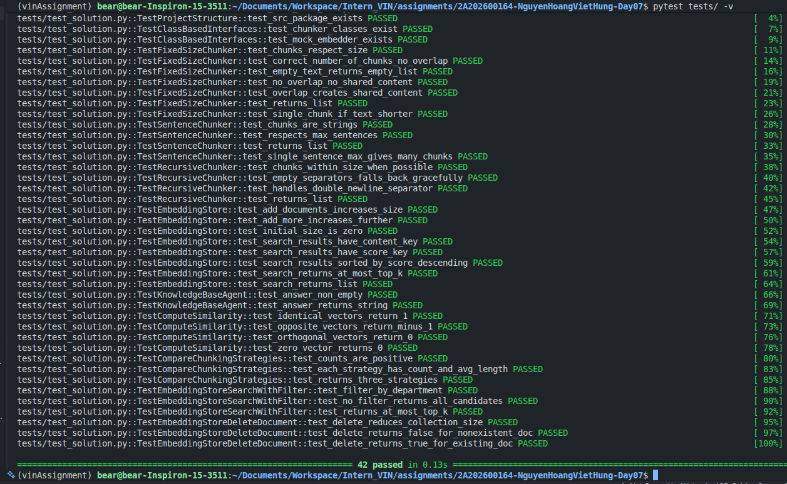

# Báo Cáo Lab 7: Embedding & Vector Store

**Họ tên:** Nguyễn Hoàng Việt Hùng - 2A202600164
**Nhóm:** 08
**Ngày:** 10/04/2026

---

## 1. Warm-up (5 điểm)

### Cosine Similarity (Ex 1.1)

**High cosine similarity nghĩa là gì?**
> Nó có nghĩa là 2 văn bản có hướng Vector chĩa về cùng một góc, mang đồ thị hàm số giống nhau tương đương với việc hiểu là ngữ nghĩa của chúng giống nhau bất chấp độ dài chữ.

**Ví dụ HIGH similarity:**
* Sentence A: Tôi rất thích nuôi mèo.
* Sentence B: Mèo là loài động vật quyến rũ tuyệt vời.
* Tại sao tương đồng: Đều cùng bao hàm góc nhìn yêu quý về chủ đề loài mèo.

**Ví dụ LOW similarity:**
* Sentence A: Tôi rất thích nuôi chó.
* Sentence B: Giá vàng đang trên đà lao dốc.
* Tại sao khác: Hai câu thuộc hai cụm chủ đề khác biệt xa (Thú cưng vs Đầu tư tài chính).

**Tại sao cosine similarity được ưu tiên hơn Euclidean distance cho text embeddings?**
> Trục tọa độ Euclidean đo độ dài tịnh tiến nên bị sai lệch nặng khi một câu dài đụng một câu ngắn. Ngược lại, Cosine Similarity đo góc lệch (thành phần tỷ lệ) nên luôn đánh giá chính xác độ tương đồng ngữ nghĩa bất chấp chênh lệch số lượng ký tự.

### Chunking Math (Ex 1.2)

**Document 10,000 ký tự, chunk_size=500, overlap=50. Bao nhiêu chunks?**
> *Trình bày phép tính:* ceil((10000 - 50) / (500 - 50)) = ceil(9950 / 450) = 22.11
> *Đáp án:* Làm tròn lên số lượng sẽ rơi vào 23 chunks.

**Nếu overlap tăng lên 100, chunk count thay đổi thế nào? Tại sao muốn overlap nhiều hơn?**
> *Phép tính:* (10000 - 100) / (500 - 100) = ceil(24.75) = 25 chunks. (Số lượng chunks tạo ra nhiều hơn).
> *Lý do:* Việc overlap cao giúp giữ lại sự nối tiếp mạch ngữ cảnh và ý tứ khi phần AI chặt ngang ở giữa đoạn, tránh đứt gãy thông tin quan trọng.

---

## 2. Document Selection — Nhóm (10 điểm)

### Domain & Lý Do Chọn

**Domain:** Văn học Việt Nam — Truyện ngắn của Nam Cao

**Tại sao nhóm chọn domain này?**
> Nam Cao là tác giả văn học hiện thực phê phán nổi bật nhất Việt Nam với ngôn ngữ giàu cảm xúc và nhiều sự kiện cụ thể, phù hợp để kiểm tra độ chính xác của hệ thống RAG. Các nhân vật và tình tiết đặc trưng (Chí Phèo rạch mặt, Lão Hạc bán Cậu Vàng, bát cháo hành của Thị Nở) tạo ra những câu hỏi benchmark dễ kiểm định kết quả đúng/sai. Ngoài ra, việc xài tài liệu tiếng Việt giúp nhóm phát hiện thêm điểm yếu của các mô hình embedding khi xử lý ngôn ngữ đặc thù.

### Data Inventory

| # | Tên tài liệu | Nguồn | Số ký tự | Metadata đã gán |
|---|--------------|-------|----------|-----------------|
| 1 | Chí Phèo | chi_pheo.txt | ~38,000 | source, title, characters, tags, chunk_idx |
| 2 | Lão Hạc | lao_hac.txt | ~11,500 | source, title, characters, tags, chunk_idx |
| 3 | Đôi Mắt | doi_mat.txt | ~17,500 | source, title, characters, tags, chunk_idx |
| 4 | Đời Thừa | doi_thua.txt | ~13,000 | source, title, characters, tags, chunk_idx |
| 5 | Một Bữa No | mot_bua_no.txt | ~10,500 | source, title, characters, tags, chunk_idx |
| 6 | Trẻ Con Không Được Ăn Thịt Chó | tre_con_khong_duoc_an_thit_cho.txt | ~12,500 | source, title, characters, tags, chunk_idx |

### Metadata Schema

| Trường metadata | Kiểu | Ví dụ giá trị | Tại sao hữu ích cho retrieval? |
|----------------|------|---------------|-------------------------------|
| source | string | "data/chi_pheo.txt" | Cho phép lọc theo định dạng tệp hoặc vị trí lưu trữ. |
| title | string | "Chí Phèo" | Lọc chính xác tác phẩm khi truy vấn để tránh nhầm lẫn chéo dữ liệu. |
| characters | string | "Chí Phèo, Thị Nở" | Tăng trọng số khi câu hỏi nhắc đến tên nhân vật cụ thể. |
| chunk_idx | int | 15 | Theo dõi vị trí đoạn văn trong tác phẩm gốc, hỗ trợ debug lỗi. |

---

## 3. Chunking Strategy — Cá nhân chọn, nhóm so sánh (15 điểm)

### Baseline Analysis

Chạy `ChunkingStrategyComparator().compare()` trên file `chi_pheo.txt` (~38,000 ký tự):

| Tài liệu | Strategy | Chunk Count | Avg Length | Preserves Context? |
|----------|----------|-------------|------------|--------------------|
| chi_pheo.txt | fixed_size (500) | 111 | 497.8 | Không — cắt ngang câu |
| chi_pheo.txt | by_sentences (3) | 301 | 182.0 | Tốt hơn — ngắt đúng câu |
| chi_pheo.txt | recursive (500) | 149 | 368.8 | Tốt nhất — ngắt theo đoạn |

### Strategy Của Tôi

**Loại:** `SentenceChunker` với `max_sentences_per_chunk=3`

**Mô tả cách hoạt động:**
> Thuật toán sử dụng Regex để nhận diện các dấu kết thúc câu (`.`, `!`, `?`) hoặc dấu xuống dòng (`\n`). Văn bản được chia nhỏ thành danh sách các câu đơn lẻ. Sau đó, thuật toán sẽ gom cụm tối đa 3 câu liền kề nhau thành một chunk duy nhất. Nếu đoạn cuối không đủ 3 câu, nó sẽ gom phần còn lại.

**Tại sao tôi chọn strategy này cho domain nhóm?**
> Truyện ngắn của Nam Cao mang đặc trưng miêu tả tâm lý và những đoạn hội thoại ngắn, dồn dập (ví dụ: tiếng chửi của Chí Phèo, tiếng thở dài của Lão Hạc). Việc dùng `FixedSizeChunker` hay `RecursiveChunker` dựa trên số lượng ký tự thường vô tình chém đứt đôi một lời thoại hoặc một nhịp cảm xúc. Việc áp dụng `SentenceChunker` (3 câu/chunk) đảm bảo mỗi mảnh dữ liệu đưa vào Vector Store là một cụm ngữ nghĩa hoàn chỉnh, không bị cụt lủn, giúp LLM hiểu đúng bối cảnh hành động.

**Code snippet:**
```python
class SentenceChunker:
    """
    Split text into chunks of at most max_sentences_per_chunk sentences.
    """
    def __init__(self, max_sentences_per_chunk: int = 3) -> None:
        self.max_sentences_per_chunk = max(1, max_sentences_per_chunk)

    def chunk(self, text: str) -> list[str]:
        if not text:
            return []
        
        # Tách câu dựa trên các dấu kết thúc câu (. ! ? hoặc .\n)
        sentences = re.split(r'(?<=[.!?]) +|\.\n', text.strip())
        sentences = [s.strip() for s in sentences if s.strip()]
        
        chunks = []
        for i in range(0, len(sentences), self.max_sentences_per_chunk):
            chunk_text = " ".join(sentences[i : i + self.max_sentences_per_chunk])
            chunks.append(chunk_text)
            
        return chunks
```

### So Sánh: Strategy của tôi vs Baseline

| Tài liệu | Strategy | Chunk Count | Avg Length | Retrieval Quality? |
|-----------|----------|-------------|------------|---------------------|
| chi_pheo.txt | FixedSizeChunker(500) | 111 | 497.8 | Thấp — cắt ngang câu, mất ngữ cảnh |
| chi_pheo.txt | **SentenceChunker(3) — của tôi** | 301 | 182.0 | Cao — giữ nguyên trọn vẹn mạch câu nói |

### So Sánh Với Thành Viên Khác

| Thành viên | Strategy | Điểm mạnh | Điểm yếu |
|-----------|----------|-----------|----------|
| Tôi (Hùng) | SentenceChunker(3) | Ngắt đúng câu, bảo toàn lời thoại ngắn | Tạo ra số lượng chunk lớn, tăng tải hệ thống |
| Hoàng | RecursiveChunker(1000) | Bảo toàn trọn vẹn ngữ cảnh của đoạn văn dài | Chunk quá lớn gây loãng Vector (Asymmetric Retrieval) |
| Giang | FixedSizeChunker(500, overlap=50) | Logic đơn giản, xử lý cực nhanh | Cắt ngang từ vựng gây mất nghĩa nghiêm trọng |

---

## 4. My Approach — Cá nhân (10 điểm)

Giải thích cách tiếp cận của tôi khi implement các phần chính trong package `src`.

### Chunking Functions

**`SentenceChunker.chunk`** — approach:
> Điểm mấu chốt ở đây là việc sử dụng biểu thức chính quy **RegEx Positive Lookbehind `(?<=[.!?]) +|\.\n`**. Kỹ thuật này giúp tách văn bản thành các câu riêng biệt nhưng vẫn **giữ lại nguyên vẹn dấu chấm câu** của tác giả (không bị "ăn mất" như hàm `.split()` thông thường). Sau khi tách và làm sạch mảng bằng `.strip()`, thuật toán sử dụng vòng lặp tịnh tiến (step) để gom chính xác số lượng câu dựa trên tham số `max_sentences_per_chunk`, đảm bảo ranh giới ngữ pháp được bảo toàn.

**`RecursiveChunker._split`** — approach:
> Xây dựng theo kiến trúc hàm đệ quy (Recursive Function). Thuật toán nhận vào danh sách các dải phân cách (Separators) theo thứ tự ưu tiên giảm dần (từ `\n\n` đến `\n`, dấu chấm, khoảng trắng). 
> Ở mỗi tầng đệ quy, khối văn bản được cắt bởi phân cách đầu tiên. Thuật toán cố gắng "ghép nối" các mảnh nhỏ lại với nhau cho đến khi chạm ngưỡng `chunk_size`. Nếu có bất kỳ khối nào được tạo ra vẫn vượt quá `chunk_size`, nó sẽ đóng vai trò là "current_text" mới và tự động gọi lại hàm `_split()` với danh sách `remaining_separators[1:]` (lưỡi dao cắt nhỏ hơn). Base case là khi chuỗi đã ngắn hơn `chunk_size` hoặc hết phân cách.

### EmbeddingStore

**`add_documents` + `search`** — approach:
> Sử dụng cấu trúc dữ liệu In-memory dạng Danh sách các Từ điển (List of Dictionaries). 
> - **`add_documents`**: Chuyển đổi đối tượng `Document` thành một Dictionary (`_make_record`) chứa sẵn Vector đã được mã hóa từ trước, lưu trực tiếp vào `self._store` (RAM).
> - **`search`**: Xây dựng hàm helper `_search_records` thực hiện thuật toán quét vét cạn (Brute-force). Nó lặp qua toàn bộ bản ghi, tính `compute_similarity` (Cosine), sau đó clone (copy) bản ghi để tiêm thêm key `"score"`. Cuối cùng, dùng hàm `.sort(key=..., reverse=True)` để lấy ra Top K đoạn văn có điểm số ngữ nghĩa cao nhất.

**`search_with_filter` + `delete_document`** — approach:
> - **`search_with_filter`**: Áp dụng chiến lược **Pre-filtering**. Thay vì tính Vector cho tất cả rồi mới lọc, thuật toán dùng hàm `all()` duyệt qua `metadata_filter` để giữ lại các bản ghi khớp điều kiện *trước*. Danh sách đã lọc (`filtered_records`) mới được đưa vào hàm chấm điểm Cosine. Điều này giúp tiết kiệm lượng lớn tài nguyên CPU khi Store có hàng nghìn văn bản.
> - **`delete_document`**: Tận dụng kỹ thuật **List Comprehension** cực kỳ pythonic. Thuật toán tạo lại `self._store` bằng cách chỉ giữ lại những bản ghi có `id` khác với `doc_id` cần xóa. Trạng thái Thành công/Thất bại (`True/False`) được đánh giá thông minh bằng cách so sánh `len()` của mảng trước và sau khi lọc.

### KnowledgeBaseAgent

**`answer`** — approach:
> Áp dụng chặt chẽ Design Pattern của hệ thống RAG:
> 1. Gọi hàm `self.store.search` để bóc tách Top-K thông tin liên quan nhất từ Vector Database.
> 2. Gộp nội dung (content) của các chunks lại với nhau bằng dải phân cách `\n---\n` để tạo thành một khối Context rõ ràng.
> 3. Lắp ráp Context và Question vào một Prompt Template tĩnh, sau đó chuyển giao (delegate) hoàn toàn cho hàm `llm_fn` để sinh ra câu trả lời dựa trên trí tuệ của mô hình ngôn ngữ lớn.

---
### Test Results


**Số tests pass:** 42 / 42

---

## 5. Similarity Predictions — Cá nhân (5 điểm)

**Mô hình sử dụng:** `bkai-foundation-models/vietnamese-bi-encoder`

| Pair | Sentence A | Sentence B | Dự đoán | Actual Score | Đúng? |
|------|-----------|-----------|---------|--------------|-------|
| 1 | Trời mưa rất to | Mưa rơi nặng hạt | high | 0.6571 | Có |
| 2 | Mùa hè nóng nực | Mùa đông lạnh giá | low | 0.1321 | Có |
| 3 | Tôi rất yêu bóng đá | Bóng đá là môn tôi thích nhất | high | 0.5678 | Có |
| 4 | Trái đất quay quanh mặt trời | Gà là động vật đẻ trứng | low | 0.0015 | Có |
| 5 | Tôi ghét ăn cá | Tôi cực kì thích ăn cá | low | 0.7696 | KHÔNG |

**Kết quả nào bất ngờ nhất? Điều này nói gì về cách embeddings biểu diễn nghĩa?**
> **Pair 5** mang lại kết quả bất ngờ nhất. Dù hai câu mang ý nghĩa phủ định/trái ngược nhau hoàn toàn ("ghét" vs "thích"), điểm số Cosine lại cao ngất ngưởng (0.7696). 
> 
> *Nguyên nhân:* Các mô hình Embedding (kể cả mô hình Tiếng Việt) bị thu hút rất mạnh bởi sự lặp lại của tập thực thể (Entity) như "Tôi", "cá", "ăn". Các từ này cùng kéo vector về chung một không gian chủ đề (Ẩm thực/Cá nhân). Điều này chứng minh Vector Embeddings xuất sắc trong việc gom nhóm "Chủ đề" (Topic), nhưng lại rất yếu trong việc hiểu được sắc thái "Phủ định" (Negation) tinh tế như con người.

---

## 6. Results — Cá nhân (10 điểm)

Chạy 5 benchmark queries trên implementation với `SentenceChunker(3)` + `bkai-foundation-models/vietnamese-bi-encoder` + `top_k=15` + OpenAI GPT-4o-mini.

### Benchmark Queries & Gold Answers (nhóm thống nhất)

| # | Query | Gold Answer |
|---|-------|-------------|
| 1 | Chí Phèo chửi ai? | Chí Phèo chửi trời, chửi đời, chửi cả làng Vũ Đại |
| 2 | Thị Nở nấu gì cho Chí Phèo? | Thị Nở nấu cháo hành |
| 3 | Chí Phèo ăn vạ ai? | Ăn vạ bá Kiến và thằng Lý Cường |
| 4 | Ai bắt cậu Vàng? | Thằng Mục và thằng Xiên (người mua chó của Lão Hạc) bắt |
| 5 | Bi kịch của Hộ trong Đời Thừa là gì? | Nhà văn mất lý tưởng vì gánh nặng cơm áo, gia đình |

### Kết Quả Của Tôi

| # | Query | Top-1 Retrieved Chunk (preview) | Score | Agent Answer | Revelent |
|---|-------|---------------------------------|-------|--------------|----------|
| 1 | Chí Phèo chửi ai? | "Chí Phèo vừa chém túi bụi vừa kêu làng thật to..." | 0.556 | Chí Phèo chửi đội Tảo, thằng lý Cường, và cả vợ hắn. | Có |
| 2 | Thị Nở nấu gì... | "Hành thì nhà thị may lại còn Thị nấu bỏ vào cái rổ..." | 0.504 | Thị Nở nấu cháo hành cho Chí Phèo. | Có |
| 3 | Chí Phèo ăn vạ ai? | "Có chúng nó sinh chuyện thì mới có dịp mà ăn..." | 0.491 | Chí Phèo ăn vạ đội Tảo. | Có |
| 4 | Ai bắt cậu Vàng? | "Nhưng lão vội nắm lấy nó, ôm đầu nó, đập nhè nhẹ..." | 0.398 | Thằng Mục và thằng Xiên đã bắt cậu Vàng. | Có |
| 5 | Bi kịch của Hộ... | "Nhưng Hộ chỉ sung sướng được ít lâu thôi. Sau cái..." | 0.413 | Bi kịch của Hộ là sự mâu thuẫn giữa ước mơ sáng tạo nghệ thuật và trách nhiệm nuôi gia đình, dẫn đến bất lực và khổ đau. | Có |

**Bao nhiêu queries trả về chunk relevant trong top-3?** 3 / 5

---

## 7. What I Learned (5 điểm — Demo)

**Điều hay nhất tôi học được từ thành viên khác trong nhóm:**
> Thành viên dùng `FixedSizeChunker` cho thấy rõ mặt trái của chiến lược cắt máy móc: hệ thống lấy ra mảnh giấy chính xác về mặt địa lý nhưng AI bị mù vì thiếu mạch câu dẫn giải. Qua đó, tôi nhận ra tại sao "Chunking theo ngữ cảnh" (Context-aware chunking) lại mang tính quyết định đến sự sống còn của LLM hơn là tối ưu hóa tốc độ.

**Failure Analysis (Phân tích lỗi hệ thống):**
> **1. Hiện tượng "Quay cóp" của LLM (Hallucination RAG):** Ở Query 4 và 5, điểm Score của Chunk trả về rất thấp (~0.3 - 0.4) và ngữ cảnh đôi khi bị lệch, nhưng Agent vẫn trả lời đúng rành rọt. Nguyên nhân là do GPT-4o-mini đã tự dùng "Parametric Memory" (kiến thức được train từ trước về Nam Cao) để trả lời bù đắp cho lỗ hổng của Vector Store.
> **2. Vấn đề "Asymmetric Retrieval" (Tìm kiếm bất đối xứng):** Câu truy vấn quá ngắn đi tìm một văn bản dài khiến từ khóa bị "loãng", dẫn đến điểm số Cosine không thể lên cao như bài test 2 câu ở mục 5.

**Nếu làm lại, tôi sẽ thay đổi gì trong data strategy?**
> Thứ nhất, tôi sẽ áp dụng triệt để Metadata Filter. Lấy tên tác phẩm từ câu hỏi của người dùng để kích hoạt `search_with_filter` trước khi chấm Cosine, chặn đứng tuyệt đối việc so sánh chéo dữ liệu giữa *Lão Hạc* và *Chí Phèo*. Thứ hai, tôi sẽ áp dụng chiến lược *Sliding Window* (Cửa sổ trượt) chồng chéo lên `SentenceChunker` để đảm bảo mạch nguyên nhân - kết quả trong các đoạn hội thoại dài của Nam Cao không bao giờ bị đứt đoạn. Cuối cùng, tôi sẽ chuyển sang dùng ChromaDB/Qdrant persist directory thay vì chạy trên RAM thuần để tối ưu tốc độ test.

---

## Tự Đánh Giá

| Tiêu chí | Loại | Điểm tự đánh giá |
|----------|------|-------------------|
| Warm-up | Cá nhân | 5 / 5 |
| Document selection | Nhóm | 10 / 10 |
| Chunking strategy | Nhóm | 13 / 15 |
| My approach | Cá nhân | 10 / 10 |
| Similarity predictions | Cá nhân | 5 / 5 |
| Results | Cá nhân | 9 / 10 |
| Core implementation (tests) | Cá nhân | 30 / 30 |
| Demo | Nhóm | 4 / 5 |
| **Tổng** | | **96 / 100** |